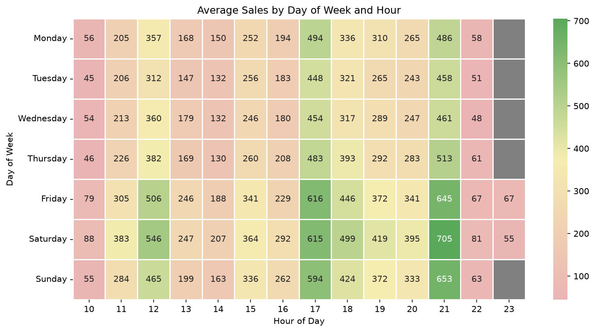
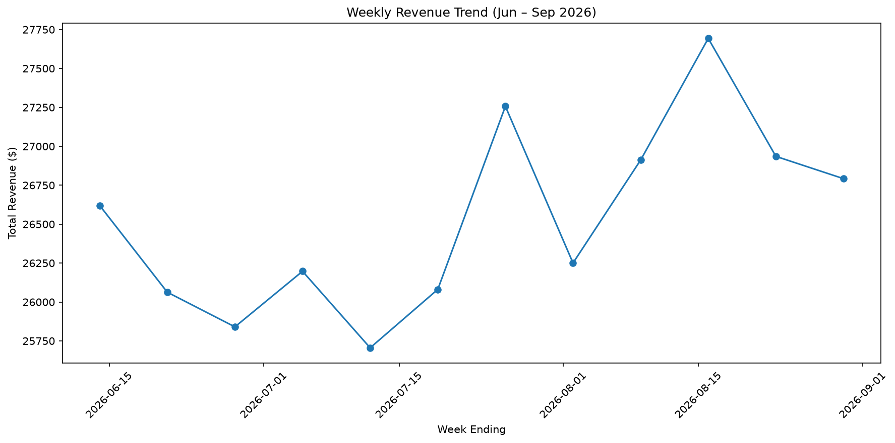
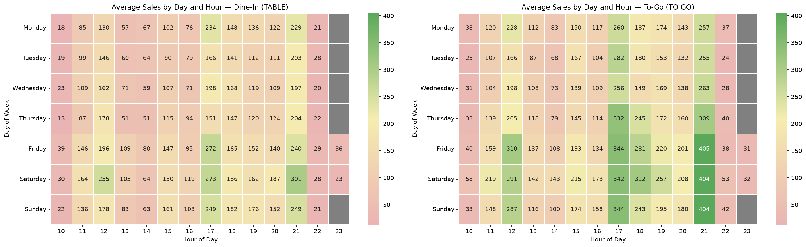
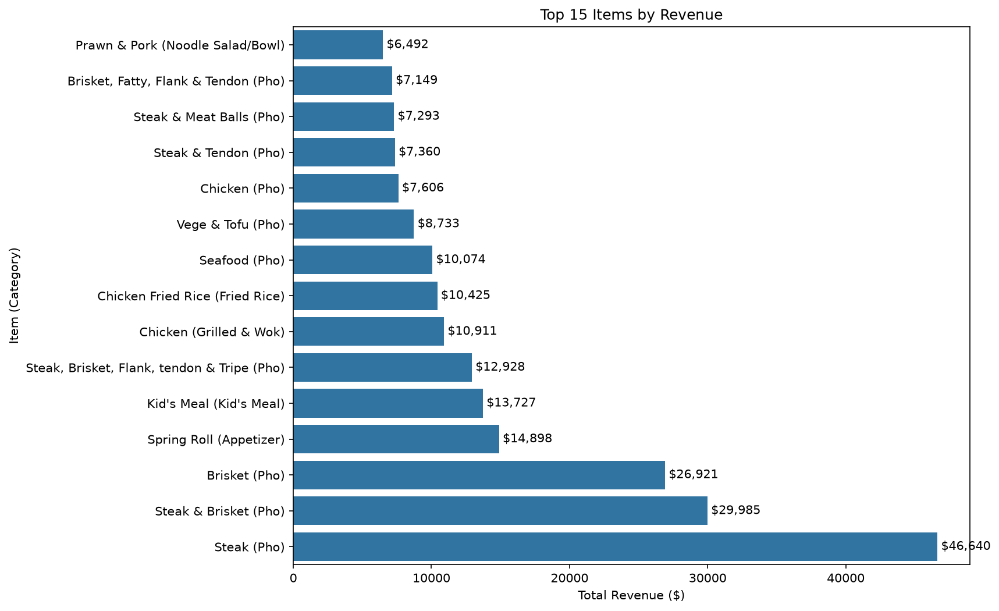

# Pho Restaurant Sales Analysis

**Checking whether "business feels slower" actually shows up in the sales data (Python + Pandas)**

*Prepared by Joe Park*

Data source: ~3 months of point-of-sale export data from my parents' restaurant (June 3 – September 2, 2026), 38,293 line items.

*Average sales by day and hour across the quarter — darker green marks the busiest slots.*

## The Question

My parents felt like business had been slowing down and wanted a specific number they could see, rather than just a feeling from being there every day. This analysis was meant to check that feeling against the actual data, along with:

- When is the restaurant busiest, by day and hour?
- Which menu items are the most popular and most profitable, and are they the same?
- Is revenue trending up, down, or holding steady?

## The Conclusion

**Revenue stayed flat across the quarter at roughly $26,000 per week — this contradicts what my parents assumed going in.** The data doesn't support "business is slowing down." That changes the conversation from "how do we stop the decline" to "how do we grow from a stable baseline."

*Weekly revenue, holding steady across the quarter rather than trending up or down.*

**Key findings:**
- Demand peaks around 12PM, 5PM, and 9PM, and is driven mostly by to-go orders rather than dine-in.

  
  *Same day/hour breakdown, split by dine-in vs. to-go — to-go consistently outpaces dine-in at the peak hours.*

- Friday, Saturday, and Sunday are the busiest days. Tuesday is the slowest.
- Steak (Pho) is both the top seller and the top revenue item. Some items are popular but don't make much money — appetizers like Spring Roll sell a lot but rank lower in revenue.

  
  *Top 15 items by revenue — Steak (Pho) leads by a wide margin.*

**Business recommendations:**
- Run a targeted special/happy hour during 1PM–4PM, the slowest window of the day.
- Run a Tuesday-specific promotion, since it's consistently the slowest day.
- Since the 5PM and 9PM peaks are mostly to-go orders, focus extra staffing there on packing to-go orders rather than table service.

## Methodology

Starting from the raw POS export, columns that were redundant, unused, or order-level values duplicated across every line item (e.g. `Order Subtotal`) were dropped, and remaining columns were renamed and retyped. `Category` values were standardized, and 89 line items timestamped after midnight (when the restaurant is closed) were removed from the source data.

The core analysis builds a day-by-hour sales heatmap — averaged per weekday occurrence rather than by item count, so it reflects how busy the restaurant actually is rather than the average price of items sold — then splits it by dine-in vs. to-go, ranks menu items by both units sold and revenue, and tracks total revenue week over week.

**Tools:** pandas, seaborn, matplotlib.

## Limitations

- **No baseline for comparison.** This is a single quarter with no prior period (last year, last quarter) to benchmark against, so "flat" describes this 13-week window only.
- **Small sample per heatmap cell.** Each day-and-hour average is built from only 13–14 data points (one per matching weekday in the quarter), so a single unusual day could shift a cell more than a real pattern would.
- **Revenue is marginally understated.** The 89 removed post-midnight records were legitimate sales (~$700), so totals in this analysis slightly undercount the restaurant's actual books.

## Full Analysis

The complete notebook — cleaning steps, all charts, and full write-up — is in [`notebooks/eda.ipynb`](notebooks/eda.ipynb).
